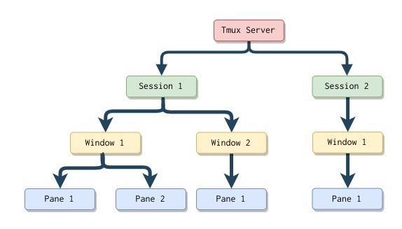

# Shell Sessions / Tmux

Sessions are a required, when you document (or func test) longer command flows, with shared internal
or external (e.g. filesystem) state.

- We do *not* keep internal state within the docu building process but rely on [tmux](https://en.wikipedia.org/wiki/Tmux) to keep it.
- This makes state accessible out of band, i.e. you can attach to tmux sessions created by lp. This
  way you can, in long lasting, complex command flows (e.g. creating clusters in the cloud) fix
  failing commands manually until they run, add the fix to the failing last block and continue with
  the next.
- Sessions are **not** automatically destroyed, except you [instruct](./parameters.md#kill_session) lp to do so.

## Mechanics

- We send the statements to evaluate over to tmux as a byte stream, using it's `send-keys` feature.
- We capture the output of tmux via it's `tmux capture-pane` feature within a loop, until
    - the expected output is seen or
    - the timeout is reached 


## Tmux Base Index

Reminder tmux:

[](./img/tmux-diag.png)

In order the mechanics to work we need to know the tmux window and pane base indexes of the window we are
communicating with, i.e. the number of the first window created within a session.

**Problem**: Default is 0. But users using tmux configure it normally to 1 (easier window switching via
shortcuts).

Since we do not want to fully control the life cycle of tmux sessions, i.e. allow the user to
interact with it before, during and after our mkdocs sessions, it would be hard and prbly. not
robust to always try find the base index currently in use - there are many things which can go wrong
here.

So we decided to either

- work out of the box, when base index is already at 1 (configured by the user) OR
- configure the base index automatically, when there is NOT yet a `~/.tmux.conf` on the system
- fail when base index is configured to be 0

!!! warning
    The second option involves a creation of `~/.tmux.conf` (which you can naturally modify to your
    liking, except setting the base index to a different value than 1).

!!! tip
    If you absolutely need to have 0 for you normal tmux work: Provide for mkdocs a tmux script, pointing to another config file in the `make` file
    or the environment ($PATH).


```python lp mode=show_src delim=configure_tmux_base_index_1 dir=src/lcdoc
```


